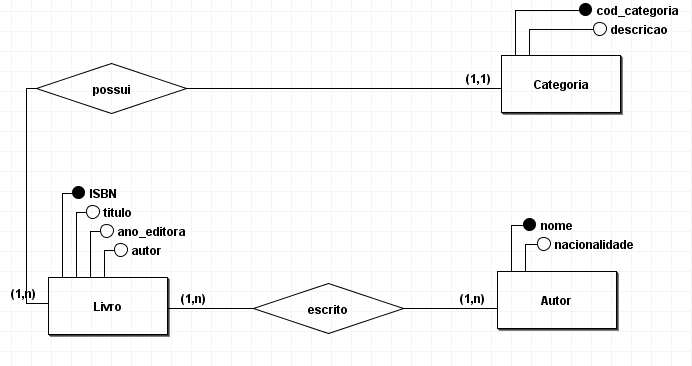
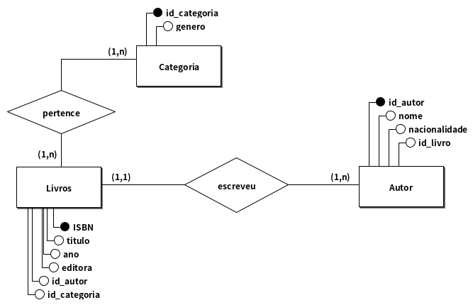
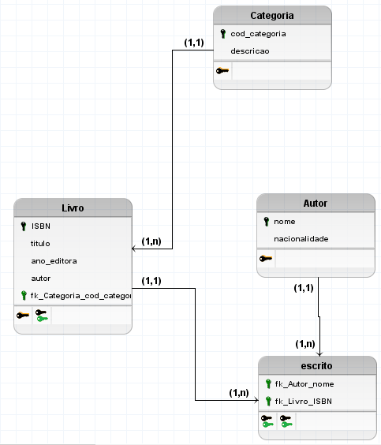

## Biblioteca de  livros e autores

Uma biblioteca deseja manter informações sobre seus livros.
Inicialmente, quer armazenar para os livros as seguintes características:
ISBN, título, ano editora e autores deste livro. Para os autores, deseja
manter: nome e nacionalidade. Cabe salientar que um autor pode ter
vários livros, assim como um livro pode ser escrito por vários autores.
Cada livro da biblioteca pertence a uma categoria. A biblioteca deseja
manter um cadastro de todas as categorias existentes, com informações
como: código da categoria e descrição. Uma categoria pode ter vários
livros associados a ela.

## Modelagem 1.0

## Modelagem 1.1

## Modelagem Logica 

[Voltar](../../README.md)