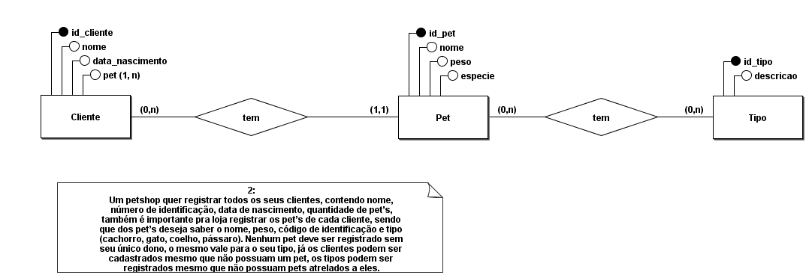

## PetShop

Um petshop quer registrar todos os seus clientes, contendo nome,
número de identificação, data de nascimento, quantidade de pet’s,
também é importante pra loja registrar os pet’s de cada cliente, sendo
que dos pet’s deseja saber o nome, peso, código de identificação e tipo
(cachorro, gato, coelho, pássaro). Nenhum pet deve ser registrado sem
seu único dono, o mesmo vale para o seu tipo, já os clientes podem ser
cadastrados mesmo que não possuam um pet, os tipos podem ser
registrados mesmo que não possuam pets atrelados a eles

## Modelagem 1.0

## Modelagem 1.1

## Modelagem Logica

[Voltar](/BancoDeDados/README.md)
